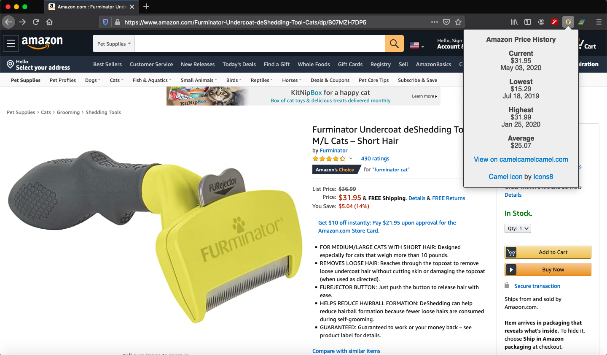

### Video Presentation:

Coming soon...

### Published Browser Extension:

Coming soon...

### Source:

https://github.com/luigilegion/caravan

### Description:

Browser extension that allows [Amazon.com](https://www.amazon.com) users to view a summary of a specific product's price history at the click of a button using data from [camelcamelcamel.com](https://camelcamelcamel.com).

MVP completed in 4 days for a solo project.

### Tech Stack:

Built using Vanilla JavaScript, HTML, and CSS.

### Dev Team:

- Tal Luigi ([LinkedIn](https://www.linkedin.com/in/talluigi) | [GitHub](https://github.com/luigilegion))
