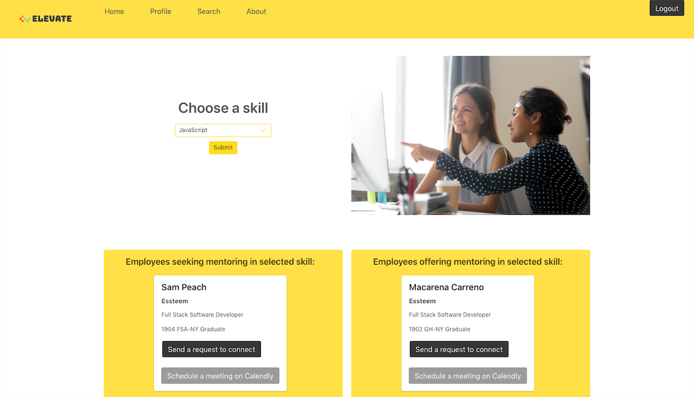

### Video Presentation:

`video: https://www.youtube.com/watch?v=BuI-knrxfHU`

### Deployed Web App:

https://elevateus.herokuapp.com

### GitHub Repository:

https://github.com/equalithon-rm/reverseMentoring

### Description:

MVP completed using Agile methodologies in 14 days for the Essteem Hackathon for Gender Equality sponsored by Nasdaq and Capital One, in which it won first place.

A long-standing issue in the tech world is the barrier to entry for women when it comes to executive level roles and managerial opportunities. With Elevate, we seek to reduce this problem and enable more women to rise through the ranks by providing them with a space to connect with impactful career sponsors.

Elevate is a web app that connects women in entry to mid-level tech roles with executives across various industries through an inclusive reverse mentoring process. The app provides a platform in which executives match with women in their field based on identified areas of expertise and then pairing with junior or mid-level employees who are interested in learning more about those topics. In turn, the millennial women seeking mentorship will also provide guidance to the executives on technical skills that they are interested in enhancing.

### Tech Stack:

Built using the NERDS stack and utilizes Bulma.css, Nodemailer, and Calendly.

### Dev Team:

- Tal Luigi ([LinkedIn](https://www.linkedin.com/in/talluigi) | [GitHub](https://github.com/luigilegion))
- Linda Saraguro ([LinkedIn](https://www.linkedin.com/in/linda-saraguro-123524122) | [GitHub](https://github.com/saragurol))
- Macarena Carreno ([LinkedIn](https://www.linkedin.com/in/mcarrenog) | [GitHub](https://github.com/macarenacarreno))
- Jocelyn Jeriah ([LinkedIn](https://www.linkedin.com/in/jocelynjeriah) | [GitHub](https://github.com/luminousbeam))
- Sam Peach ([LinkedIn](https://www.linkedin.com/in/sam-peach) | [GitHub](https://github.com/sam-peach))
