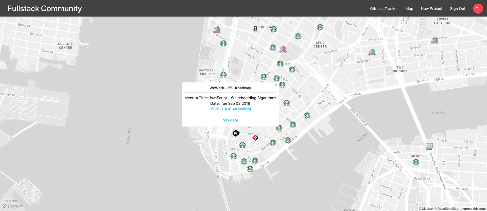

### Video Presentation:

`video: https://www.youtube.com/watch?v=hm4WL8kcvHo&feature=youtu.be`

### URL:

https://fullstack-community.web.app

### GitHub Repository:

https://github.com/LuigiLegion/fullstackcommunity

### Description:

Fullstack Community is a Fullstack Academy themed web app that connects past and present Fullstack students. The app allows current students and unemployed alums to form study groups and work on projects or practice algorithms together, while also allowing unemployed alums set up coffee meetings with employed alums that work for companies that they would like to work for in New York City.

### Tech Stack:

The app was built using Node.js and Firebase on the backend, React.js, Redux.js, and Materialize.css on the frontend, and utilizes the Mapbox, MTA, Socrata Open Data, NYC Open Data, and Meetup APIs. It was completed in 4 days for a hackathon, and is continually being improved upon for the benefit of future Fullstack Academy and Grace Hopper generations to come.
