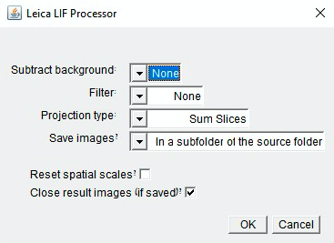

### Video Presentation:

Coming soon...

### GitHub Repo:

https://github.com/LuigiLegion/facultech

### Description:

Coming soon...

MVP completed in 2 days as part of an image analysis automation project for the Hebrew University of Jerusalem's Interdepartmental Equipment Unit.

### Tech Stack:

Coming soon...

### Dev Team:

- Tal Luigi ([LinkedIn](https://www.linkedin.com/in/talluigi) | [GitHub](https://github.com/luigilegion))
- Daniel Waiger ([LinkedIn](https://www.linkedin.com/in/daniel-waiger-9433ab15a) | [GitHub](https://github.com/daniel-waiger))
