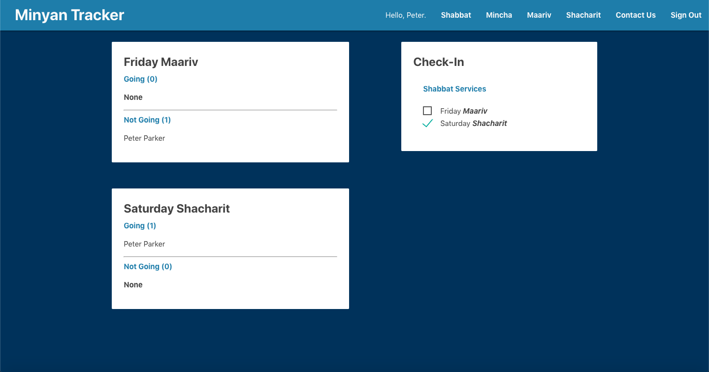

### Video Presentation:

Coming soon...

### Deployed Web App:

https://minyan-tracker.web.app

### GitHub Repository:

https://github.com/luigilegion/minyan-tracker

### Description:

Responsive web app that allows users to check-in to services at their congregations and share their check-in status with their fellow congregation members in real time.

MVP completed in 4 days for a solo project.

### Tech Stack:

Built using Node.js and Firebase on the backend and React, Redux, and Materialize on the frontend.

### Dev Team:

- Tal Luigi ([LinkedIn](https://www.linkedin.com/in/talluigi) | [GitHub](https://github.com/luigilegion))
