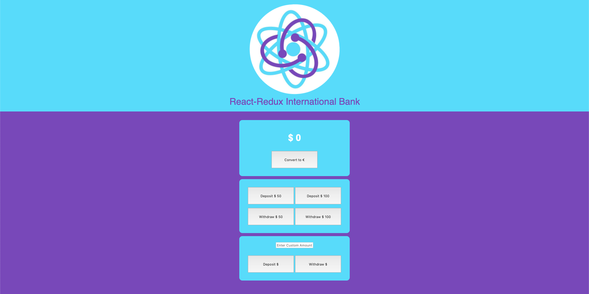

### Video Presentation:

Coming soon...

### Deployed Web App:

https://react-redux-bank.web.app

### Source:

https://github.com/luigilegion/react-redux-bank

### Description:

Educational workshop that goes through the steps of setting up a mock bank web app using React, Redux, and React-Redux.

MVP completed in 2 days for a code-along.

### Tech Stack:

Built using React, Redux, and React-Redux, and utilizes the Free Forex API.

### Dev Team:

- Tal Luigi ([LinkedIn](https://www.linkedin.com/in/talluigi) | [GitHub](https://github.com/luigilegion))
