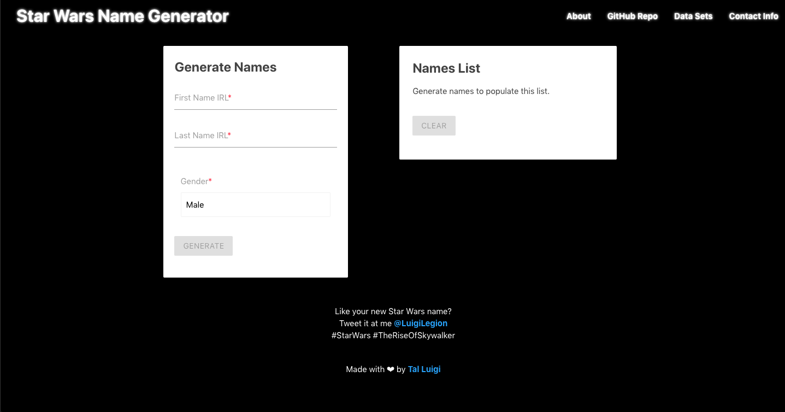

### Video Presentation:

Coming soon...

### Deployed Web App:

https://star-wars-name-generator.web.app

### Source:

https://github.com/luigilegion/star-wars-name-generator

### Description:

Responsive web app that allows users to create their very own Star Wars name based on any name. Names are generated out of over 22,000 first names and 10,000 last names from both Canon and Legends by utilizing a set of custom string matching algorithms.

MVP completed in 4 days for a solo project.

### Tech Stack:

Built using Node.js and Firebase on the backend, React, Redux, and Materialize on the frontend, and utilizes the Web Speech, Clipboard, and Wikia APIs.

### Dev Team:

- Tal Luigi ([LinkedIn](https://www.linkedin.com/in/talluigi) | [GitHub](https://github.com/luigilegion))
