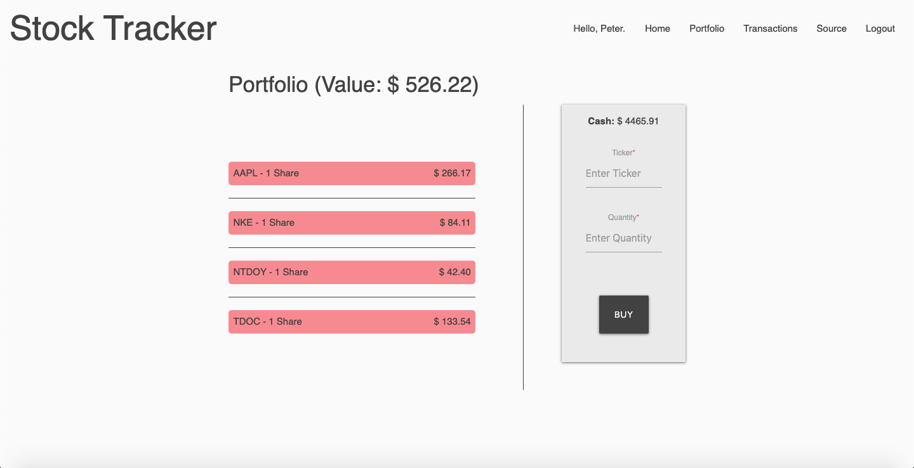

### Video Presentation:

Coming soon...

### Deployed Web App:

https://iex-stock-tracker.herokuapp.com

### GitHub Repo:

https://github.com/LuigiLegion/stock-tracker

### Description:

Responsive web app that...

MVP completed in 14 days for a solo project.

### Tech Stack:

Built using Node.js, Express, PostgreSQL, and Sequelize on the backend, React, Redux, and Materialize.css on the frontend, and utilizes the IEX Cloud API.

### Dev Team:

- Tal Luigi ([LinkedIn](https://www.linkedin.com/in/talluigi) | [GitHub](https://github.com/luigilegion))
