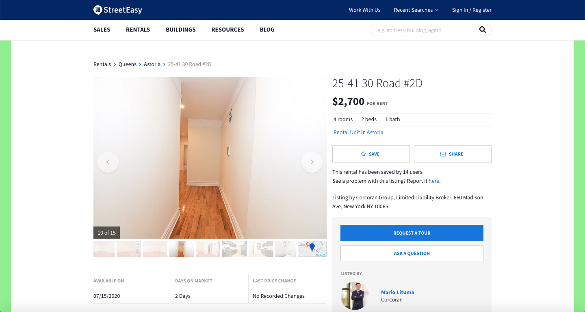

### Video Presentation:

Coming soon...

### Published Browser Extension:

Coming soon...

### Source:

https://github.com/luigilegion/streetpeasy

### Description:

Browser extension that retrieves data regarding the description, amenities, and highlights of a specific listing on [StreetEasy.com](https://streeteasy.com), parses it, and checks it against a predetermined checklist, at the end of which the borders of the page of said listing will be colored green if it checks all of the necessary boxes or red if it does not.

MVP completed in 1 day for a solo project.

### Tech Stack:

Built using Vanilla JavaScript, HTML, and CSS.

### Dev Team:

- Tal Luigi ([LinkedIn](https://www.linkedin.com/in/talluigi) | [GitHub](https://github.com/luigilegion))
