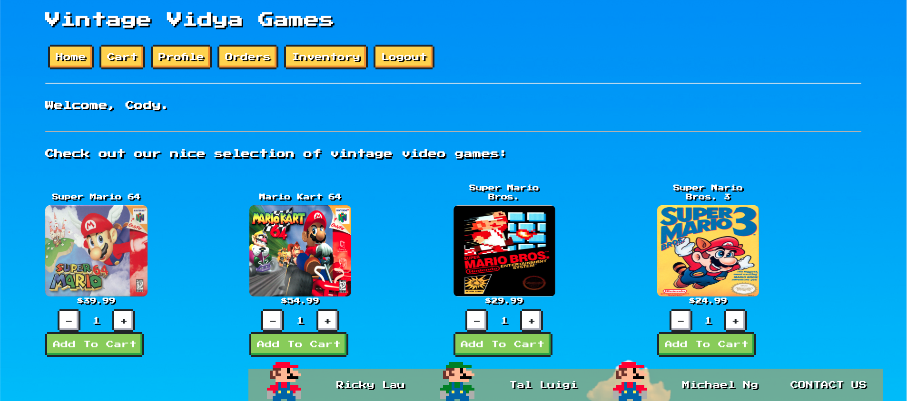

### Video Presentation:

Coming soon...

### Deployed Web App:

https://vintage-vidya-games.herokuapp.com

### GitHub Repo:

https://github.com/fiesty-fish/vintageesportsllc

### Description:

NES themed e-commerce responsive web app that offers old-school video games for sale.

MVP completed using Agile methodologies in 10 days for a group project.

### Tech Stack:

Built using the NERDS stack and utilizes NES.css and the Stripe API.

### Dev Team:

- Tal Luigi ([LinkedIn](https://www.linkedin.com/in/talluigi) | [GitHub](https://github.com/luigilegion))
- Michael Ng ([LinkedIn](https://www.linkedin.com/in/michael-m-ng) | [GitHub](https://github.com/xmng))
- Ricky Lau ([LinkedIn](https://www.linkedin.com/in/rickylaudev) | [GitHub](https://github.com/rickylaufitness))
